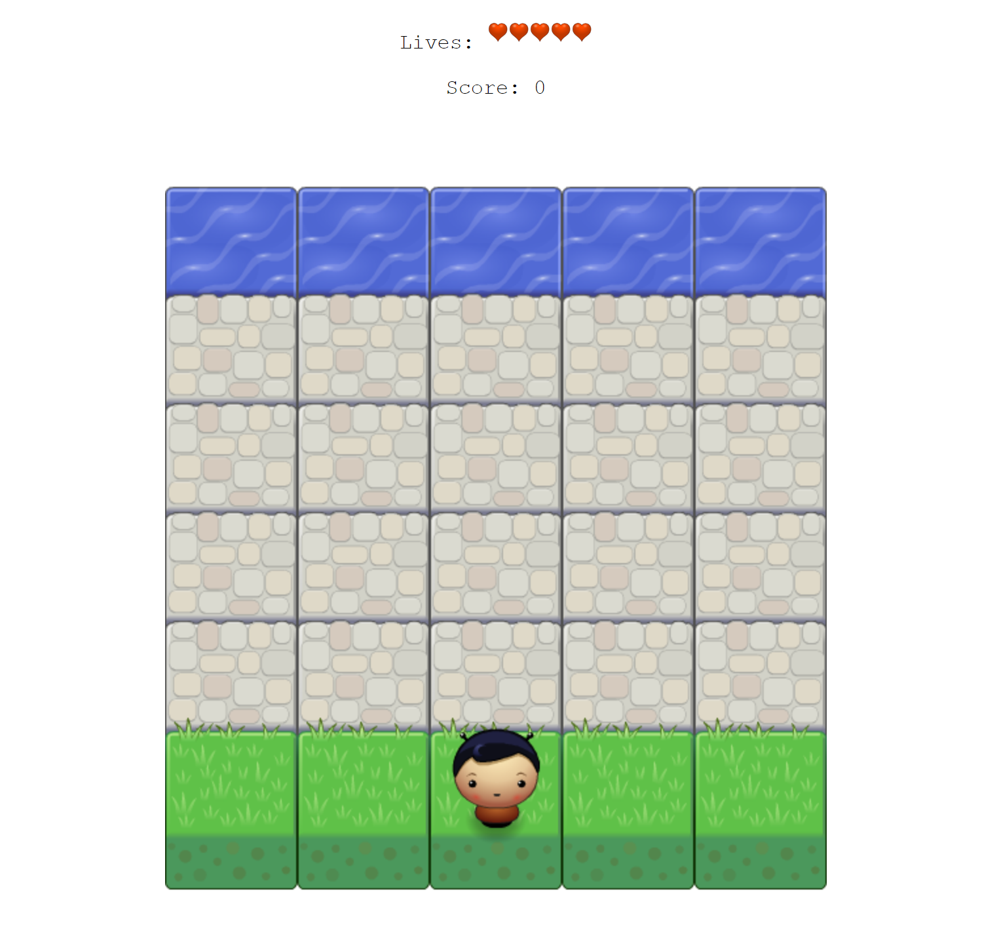
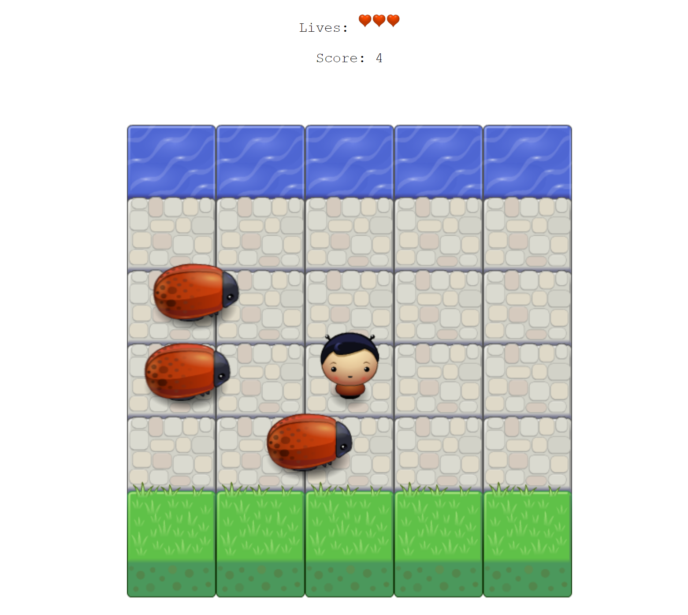

#Arcade game Project
A arcade game based off the video game "Frogger" for Udacity's Front-End Web Development Nanodegree

##How to Play

1. Start the game either by going to the [live site](https://jasonrhowie.com/arcade-game/), or download the zip file from this repository and opening up 'index.html'.

2. Use the 'up', 'down', 'left' and 'right' keys on your keyboard to move the player. Avoid contact with the enemy vehicles and try to make it to the water. If you make it to the water a point is added to your score. If you hit an enemy, a life is subtracted. If you reach zero lives your score goes back to zero.

##Screenshots

##Made with

HTML
CSS
JavaScript
Jquery - Used for the score panel